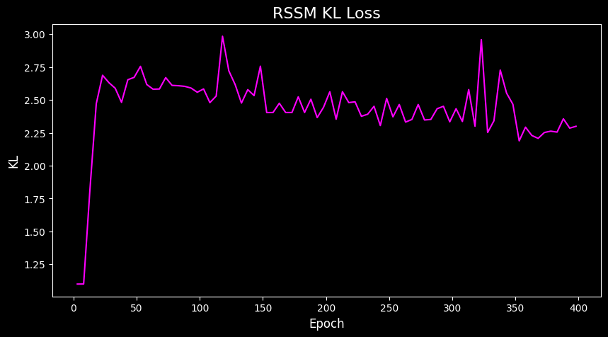
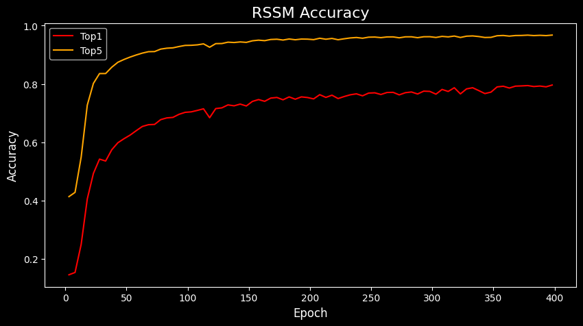

# Cookie-Run-AI-v3
Play in an environment where an AI learns the first stage of Cookie Run, “The Witch's Oven,” and generates the next screen in real time based on your input.  

**Previous Version:**  
- https://github.com/Jeon-ChanYoung/Cookie-Run-AI
- https://github.com/Jeon-ChanYoung/Cookie-Run-AI-v2

<br>

| Item | Detail |
|------|--------|
| **Observation Size** | 128×256 pixels |
| **Action Space** | 3 actions (None, Jump, Slide) |
| **Training Data** | 50 real gameplay videos (~48,000 frames) |

<br>

## Training Data Distribution

> **Total Frames: 47,704** (from 50 real gameplay videos)

| Action | Label | Frames | Ratio |
|:------:|-------|-------:|------:|
| 0 | None | 35,773 | 75.0% |
| 1 | Jump | 1,249 | 2.6% |
| 2 | Slide | 10,682 | 22.4% |

<br>
  
## Real


<br>
  
## Fake (AI-generated)


#### Model Architecture & Improvements

This project is an **enhanced version of Cookie-Run-AI v2**, featuring significant architectural improvements to solve the training bottlenecks observed in the previous version. 

| Feature | v1 | v2 | **v3 (Current)** |
|---------|----|----|------------------|
| **Architecture** | End-to-end RSSM | Two-stage (VQ-VAE $\rightarrow$ RSSM) | **Two-stage (FSQ $\rightarrow$ RSSM)** |
| **Quantization** | None (Continuous) | Vector Quantization (EMA) | **Finite Scalar Quantization (FSQ)** |
| **Codebook Size ($K$)** | - | 256 | **64** (Levels: [4, 4, 4]) |
| **Code Dim ($D$)** | - | 8 | **3** |
| **Spatial Resolution** | Pixel level | 16 x 32 (512 tokens) | **8 x 16 (128 tokens)** |
| **CNN Backbone** | Standard CNN | Standard ResNet | **Enhanced ResNet (deeper)** |

<br>

### Experiment
**The Bottleneck in v2:**  
When using a token grid of 512 tokens (16×32) with a codebook size of 256, the RSSM training consistently plateaued at an early stage. The RSSM decoder had to solve a highly complex prediction problem: predicting one of 256 categories for each of the 512 spatial tokens at every step. This substantially increased the reconstruction burden on the world model and limited downstream accuracy.

**The Solution in v3:**  
To address this, we implemented **FSQ (Finite Scalar Quantization)** and aggressively reduced the complexity of the latent space:
1. **Token Compactness:** Reduced the spatial token resolution from 16×32 to **8×16** (128 tokens).
2. **Simplified Codebook:** Reduced the codebook size ($K$) from 256 to **64** and dimensions ($D$) from 8 to **3**.
3. **Enhanced Autoencoder:** Such extreme compression (roughly a 1000:1 ratio) could degrade reconstruction quality. To compensate, we **substantially strengthened both the encoder and decoder architectures** (adding DownBlocks, UpBlocks, and more ResBlocks), allowing the tokenizer to preserve visual fidelity despite the much tighter bottleneck.
4. **Optimized RSSM:** Lightweighted and optimized the network module to accommodate the reduced token dimensions.

<br>

## Loss 

### VQ-VAE Loss


```
Epoch [ 1/30] VQ-VAE loss: 1.179069  recon: 0.040051  p_l: 3.796725
Epoch [ 2/30] VQ-VAE loss: 0.634990  recon: 0.026097  p_l: 2.029643 
Epoch [ 3/30] VQ-VAE loss: 0.459326  recon: 0.020848  p_l: 1.461594 
Epoch [ 4/30] VQ-VAE loss: 0.412156  recon: 0.020268  p_l: 1.306292 
Epoch [ 5/30] VQ-VAE loss: 0.403967  recon: 0.020089  p_l: 1.279593 
...
Epoch [26/30] VQ-VAE loss: 0.229845  recon: 0.014724  p_l: 0.717070 
Epoch [27/30] VQ-VAE loss: 0.234596  recon: 0.014913  p_l: 0.732277 
Epoch [28/30] VQ-VAE loss: 0.242575  recon: 0.015040  p_l: 0.758450  
Epoch [29/30] VQ-VAE loss: 0.245375  recon: 0.014927  p_l: 0.768160 
Epoch [30/30] VQ-VAE loss: 0.231396  recon: 0.014662  p_l: 0.722447  
```

As you can see here, even if we reduce K and D slightly, the final loss values remain similar. Therefore, reducing K and D makes it much easier for the RSSM to learn.  

<br>

### RSSM Loss


<br>



<br>



```
Epoch [  1/400] RSSM loss: 3.573033  recon: 3.463033  kl: 1.100000  acc: 0.1418  top5: 0.4047
Epoch [  2/400] RSSM loss: 3.530106  recon: 3.420106  kl: 1.100000  acc: 0.1437  top5: 0.4121
Epoch [  3/400] RSSM loss: 3.526842  recon: 3.416842  kl: 1.100000  acc: 0.1437  top5: 0.4110
Epoch [  4/400] RSSM loss: 3.500003  recon: 3.390003  kl: 1.100000  acc: 0.1476  top5: 0.4177
Epoch [  5/400] RSSM loss: 3.488622  recon: 3.378612  kl: 1.100107  acc: 0.1486  top5: 0.4210
...
Epoch [396/400] RSSM loss: 0.815932  recon: 0.597647  kl: 2.182859  acc: 0.7973  top5: 0.9679
Epoch [397/400] RSSM loss: 0.877138  recon: 0.614608  kl: 2.625297  acc: 0.7909  top5: 0.9660
Epoch [398/400] RSSM loss: 0.822521  recon: 0.594985  kl: 2.275353  acc: 0.7975  top5: 0.9681
Epoch [399/400] RSSM loss: 0.823704  recon: 0.600613  kl: 2.230909  acc: 0.7963  top5: 0.9675
Epoch [400/400] RSSM loss: 0.809256  recon: 0.591078  kl: 2.181778  acc: 0.7989  top5: 0.9684
```

Here, acc (Accuracy) and top5 (Top-5 Accuracy) measure how well the RSSM's decoder predicts the correct VQ token index at each spatial position:  

- acc (Top-1 Accuracy): The proportion of spatial tokens for which the RSSM decoder's single highest-probability prediction exactly matches the ground-truth VQ token index. An accuracy of 0.7989 means that ~80% of the 128 tokens per frame are predicted correctly on the first guess.  

- top5 (Top-5 Accuracy): The proportion of spatial tokens for which the ground-truth VQ token index appears within the decoder's top 5 highest-probability predictions (out of 64 possible codebook entries). A top-5 accuracy of 0.9684 means that ~97% of the time, the correct token is among the model's 5 most confident candidates.  

<br>

## How to Run  
**1. Clone the repository and install dependencies:** 
```
git clone https://github.com/Jeon-ChanYoung/Cookie-Run-AI-v3.git
pip install -r requirements.txt
```

<br>

**2. Setup Pre-trained Model:**  
Download the pre-trained weights (vqvae_ep30.pth, rssm_ep100.pth) from the Releases page and place them in the directory structure as follows:  
```
model_params/
    └── rssm_ep400.pth
    └── vqvae_ep30.pth
```
If model_params does not exist, create it.  

<br>

**3. Run the main.py(FastAPI-based)**  
```
python main.py
```

<br>

## Simulation  


- ⬆️ Arrow Up: Jump
- ⬇️ Arrow Down: Slide
- 🔄 R Key: Reset
